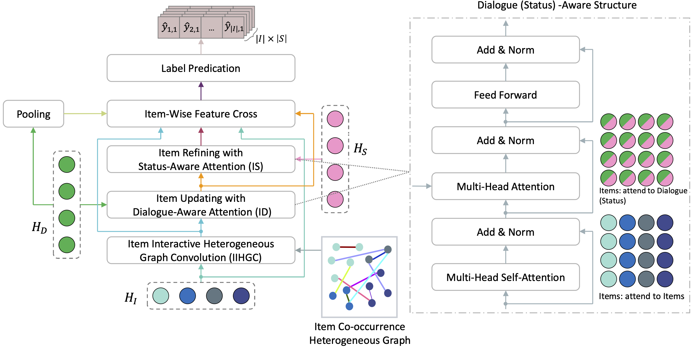

# DMIE-EMNLP2023

> As we are working on camera ready right now, code will be released in the near future.

This is the official repository of our EMNLP 2023 paper *Dialogue Medical Information Extraction with Medical-Item Graph and Dialogue-Status Enriched Representation*. Welcome! 🤩🤩🤩



# Citation 📖

Please cite our work if you found the resources in this repository useful:

``` bib
@inproceedings{gao2023dmie,
    title={Dialogue Medical Information Extraction with Medical-Item Graph and Dialogue-Status Enriched Representation},
    author={Lei Gao and Xinnan Zhang and Xian Wu and Shen Ge and Yefeng Zheng},
    booktitle={EMNLP},
    year=2023
}
```
